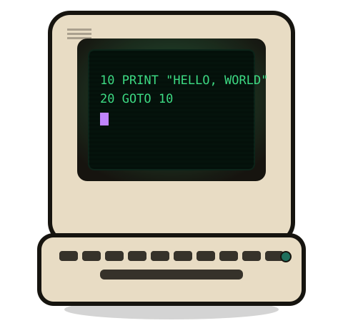

# BASCAL



**B**eginner's **A**ll-purpose **S**tructured **C**omputer **A**pplication
**L**anguage.

*A fun project, built mostly to see what's possible — not really meant for
building a real 2026 application. See [the origin story](https://johnjoeallen.github.io/bascal/origin.html).*

The `bcc` transpiler translates structured `.bcl` source into an intermediate
language that can then be compiled into a runnable binary. Two backends are
available, selected with `--target`: `basic` (default) — plain 1980s
Microsoft BASIC, compiled with a period BASIC compiler like BASCOM or
FreeBASIC's QB-compatible mode — is fully functional; `C` — native C,
compiled directly with `gcc`, no BASIC compiler involved — is an
experimental backend still under development.

**[Browse the website](https://johnjoeallen.github.io/bascal/)** for
tutorials, side-by-side syntax comparisons, and the full
[language manual](https://johnjoeallen.github.io/bascal/manual/) — the
complete language reference lives there, not in this repo.

BASCAL keeps BASIC's global symbol model while adding enough structure to make
larger programs practical:

- multiline `if` / `else if` / `else` / `end if`
- `for` / `next`, `while` / `wend`, and `do` loops with early exit — `do`
  comes pre-check (`do [while/until cond] ... end do`) or post-check
  (`do ... loop [while/until cond]`, BASCAL's `repeat`/`until` equivalent)
- `function` declarations with explicit `return`
- `byref` / `byval` parameter passing modes (`byval`, the default, copies a
  parameter in only; `byref` copies the result back out too, for scalars
  and arrays alike) with transpile-time checks for both — a `byref` argument
  must be a plain variable, and a passed array's dimensionality must match
  how the callee indexes it
- path-style `require` dependencies
- `program name [shared sharedname]` declaration with `COMMON` block coordination; `library name` marks a `require`/`import` target
- `select case` with single values, ranges, and `is` comparisons
- `&&` / `||` short-circuit operators for `if`/`elseif`/`while`/`do` conditions
  — unlike bitwise `AND`/`OR`, the second operand is only evaluated when it
  can still change the answer
- `+=` / `-=` / `*=` / `/=` compound assignment, `TRUE` / `FALSE` literals
  (`-1` / `0`), and comma-separated multi-name `dim a%, b%(3), c$`
- `/* */` block comments flattened to `'` lines in generated output
- `input`, `data` / `read` / `restore`, `const`, `locate`, `color`, `on ... goto`
- BASIC type suffixes (`%` integer, `$` string, `!` single, `#` double, `&` long)
- source comments preserved in generated output
- generated `.bas` output using line-number `GOTO` / `GOSUB`
- `record` / `file` DSL: typed fixed-layout records (`int16`, `int32`,
  `float32`, `float64`, `string(N)`) with `file db as T = open(path)`,
  `db[i] = { ... }` / `db[i] = ?{ ... }` (partial), `let s = db[i]`,
  `db[i].field = value`, `db[i] = s`, and `db.close()`, all transpiled to plain
  `FIELD`/`PUT`/`GET`/`LSET`/`MKx`/`CVx` — see
  [Record Files](https://johnjoeallen.github.io/bascal/manual/record-files.html)
  in the manual and
  [`tutorial/15_random_and_record_files.bcl`](tutorial/15_random_and_record_files.bcl)

Everything is still global. Path-style names are dependency selectors, not
runtime namespaces.

BASCAL is a strict superset of classic BASIC — bitwise `AND`/`OR`/`NOT` and
hand-written `OPEN`/`FIELD`/`GET`/`PUT` all still pass through unchanged.
`GOTO`/`GOSUB`/`ON ERROR GOTO`/`RESUME`/`RESTORE` are raw BASIC too, but
BASCAL manages line numbering itself, so their targets are always a `name:`
label declared in source — never a raw line number. Beyond that, wherever
BASCAL has its own construct for something above, treat that construct as
canonical: it's the syntax the transpiler exists to let you write instead of
the raw-BASIC equivalent, not just another option.

## Build

```bash
env -u RUSTC_WRAPPER cargo build
```

Generated `basic`-target output runs under any QB-compatible compiler, e.g.
FreeBASIC's QB mode: `fbc -lang qb output.bas -x binary` (see the
[Examples](#examples) below for full worked runs).

## Release Packages

GitHub Actions builds release packages from `.github/workflows/packages.yml`.
Run the **Packages** workflow manually to produce downloadable artifacts, or
push a `v*` tag such as `v0.1.0` to attach the Debian `.deb`, RPM, Linux
`.tar.gz`, and Windows `.zip` packages to a GitHub Release.

## Usage

```bash
bcc input.bcl [-o path] [-L dir] [-l library]
              [--line-numbers | --sparse-line-numbers] [--clean | -c]
              [--binary | -b] [--run | -r] [--target | -t basic|C]
```

| Flag | Meaning |
|------|---------|
| `-o path` | Output path. A directory (existing, or written with a trailing `/` even if it doesn't exist yet) gets an auto-named file inside it; anything else is the output file path. Default: input with `.bas`/`.c` extension, same directory as input |
| `-L dir` | Add a library search directory for `require` resolution (repeatable) |
| `-l name` | Name a library (reserved for future use) |
| `--line-numbers` | Number every output line, not just branch targets (the default) |
| `--sparse-line-numbers` | Number only branch targets, not every line. Real MBASIC/BASCOM-family compilers need a switch for this: Microsoft's BASCOM uses `/C`, IBM's BASIC Compiler uses `/N`; FreeBASIC's `-lang qb` accepts it with no switch at all |
| `--clean`, `-c` | Re-transpile even if output is already up to date |
| `--binary`, `-b` | Compile the generated output to a binary in `tmp/`: `fbc` for `basic`, `gcc` for `C` |
| `--run`, `-r` | Also run the compiled binary (implies `--binary`). For `basic` this always means `fbc`'s binary, run directly — not real BASCOM, whose own `.EXE` needs a DOS environment/emulator like dosbox-x to run at all |
| `--target`, `-t` | Backend to generate code for: `basic` (default) or `C` (see [Backends](#backends)) — case-insensitive |

The input file's directory is always the first implicit search root. `-L` adds
additional roots searched in order.

### Default target

Without `--target`, `bcc` picks a default from, first match wins: the
`BASCAL_TARGET` environment variable; `~/.config/bascal/config`
(`target=C`, one `key=value` setting per line, `#` comments allowed);
`/etc/default/bascal` (same format, system-wide); otherwise `basic`. An
explicit `--target`/`-t` always overrides whatever this picks. Handy for
setting `C` as your working default without typing `--target C` on every
call:

```bash
mkdir -p ~/.config/bascal
echo "target=C" > ~/.config/bascal/config
```

## Backends

BASCAL has two code generators, selected with `--target`: **`basic`**
(default) — the original, complete target, plain 1980s Microsoft
BASIC/BASCOM — and **`C`**, an experimental native-C backend aiming to
produce native Linux/macOS/Win32 binaries directly, with no BASIC
compiler involved. Full detail on both — exactly what `--target C`
supports today, and every BASIC-vs-C semantic decision behind it — lives
on the website's
[Backends](https://johnjoeallen.github.io/bascal/manual/command-line-reference.html#backends)
section, kept current there rather than duplicated here.

## Dependencies

`require`/`import` recursively load `.bcl` files by dotted path (dots
become directory separators, e.g. `com.bascal.sort.bubbleSort` →
`com/bascal/sort/bubbleSort.bcl`), searched first in the input file's own
directory, then any `-L` roots in order. See the manual's
[Dependencies](https://johnjoeallen.github.io/bascal/manual/dependencies-require-and-import.html)
chapter for the full module-convention rules.

## Shared COMMON

`shared` files coordinate `COMMON` across chained (`CHAIN`) programs —
every variable `dim`ed in a shared file becomes `COMMON`, verbatim, at
the top of every program that names it. See the manual's
[Shared COMMON](https://johnjoeallen.github.io/bascal/manual/shared-common.html)
chapter for a full worked example and the file-declaration rules.

## Repository Layout

```
src/        Rust transpiler source
examples/   BASCAL source examples (.bas generated alongside each .bcl)
tmp/        temporary compiled binaries (git-ignored)
```

## Examples

### Sort driver

`examples/sort_driver.bcl` exercises recursive `require`, array argument
passing, and timing:

```bash
cargo run -- examples/sort_driver.bcl
fbc -lang qb examples/sort_driver.bas -x tmp/sort_driver
./tmp/sort_driver
```

Expected output (5000 reverse-sorted elements):

```
Bubble sort time (ms):       ~200
Bubble: OK
Shaker sort time (ms):       ~180
Shaker: OK
Shell sort time (ms):        ~1
Shell: OK
Quick sort time (ms):        ~1
Quick: OK
```

### REMLINE

`examples/remline` is a real-world BASCAL example inspired by old BASIC
line-number utilities. It analyses a line-numbered BASIC program and removes
unnecessary line numbers while preserving referenced targets. The generated
program reads `examples/remline/sample/input.bas` and writes the cleaned
listing to `examples/remline/sample/output.bas`.

```bash
cargo run -- examples/remline/remline.bcl -L examples/remline
fbc -lang qb examples/remline/remline.bas -x tmp/remline
./tmp/remline
diff -u examples/remline/sample/expected.bas examples/remline/sample/output.bas
```

### Arcade shared COMMON

`examples/arcade` demonstrates shared `COMMON` coordination across two programs
that share score, level, and player state.

```bash
cargo run -- examples/arcade/menu.bcl
cargo run -- examples/arcade/game.bcl
```

Both generated `.bas` files open with the same `COMMON` block drawn from
`arcade.bcl`, ready to exchange state via `CHAIN`.

### Card catalog

`tutorial/card_catalog.bcl` is the flagship record/file DSL example: two
record types (`Header`, `Entry`) sharing one random-access file, and five
`procedure`s (`addItem`, `listAll`, `searchByAuthor`, `searchByAuthorTitle`,
`deleteItem`) that each read and write those records from inside their own
body — exercising record/file access from procedure scope, not just
top-level code. A `mainMenu` procedure drives them from an interactive,
`INPUT`-based menu loop. It's adapted from `CLERK.BAS`, a 1983 card-catalog
manager by Carlos A. Lujan S.; see the comment header in the source for the
full attribution and porting notes.

```bash
cargo run -- tutorial/card_catalog.bcl
fbc -lang qb tutorial/card_catalog.bas -x tmp/card_catalog
./tmp/card_catalog   # interactive -- follow the on-screen menu
```

## Tests

```bash
env -u RUSTC_WRAPPER cargo test
```

- Unit-tests for lexer, parser, validation, and function transpilation
- Transpiles every driver-style `examples/**/*.bcl` file (excluding `com/`
  dependency trees) and writes `.bas` output alongside the source
- If `fbc` is installed, compiles and runs `sort_driver` and `remline`
  end-to-end
- If `dosbox-x` is installed *and* `test-fixtures/ibm-basic-compiler/` has
  been populated (see [CONTRIBUTING.md](CONTRIBUTING.md)), compiles
  conformance fixtures against the real IBM BASIC Compiler 2.00 and diffs
  its output against checked-in golden expectations. Opt-in and local by
  default -- skipped cleanly otherwise.

## Current Limits

- An array parameter's shared storage is `DIM`ed once, sized to the largest
  array any call site ever passes it. The transpiler infers that size itself
  from every call site's `DIM` bounds (literal, `const`, or another
  function's already-resolved array parameter); a call site whose size is a
  genuine runtime value (e.g. `DIM data%(n%)` where `n%` came from `INPUT`)
  needs an explicit capacity written on the parameter instead of `?`. See
  [Array Parameter Storage Capacity](https://johnjoeallen.github.io/bascal/manual/arrays.html#array-parameter-storage-capacity)
  in the manual.
